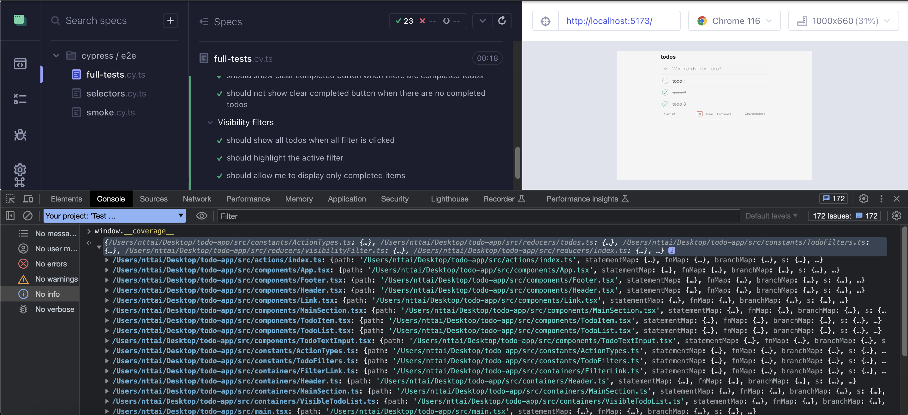
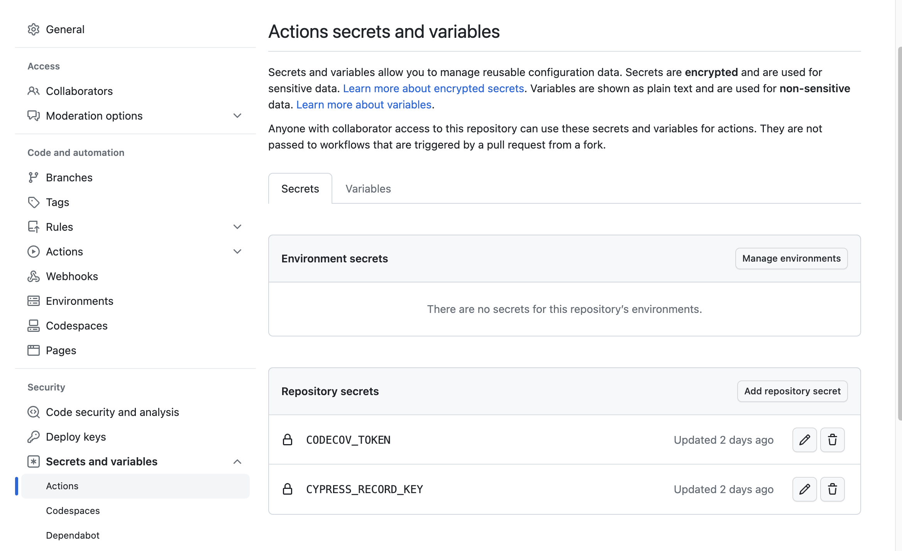

# Testing methodology, code coverage and instrumentation

Writing tests is important, but sometimes it can be boring because you are just trying to write as many tests as possible. As a developer, you must decide what to test and what not to test. You need to know how much of your code is covered by tests. This is where test coverage comes in. It's not only helps you save time, but also helps you to write better tests and define a better testing strategy.

## unit tests, e2e tests and test coverage

**A unit test** is a test that tests a single unit of code. It focuses on verifying the functionality and correctness of individual unit. If your application has many components, functions and classes. Each unit test will iteratively test each component, function and class independently.

For example, our code have two functions `add` and `subtract` in `src/utils/math.js` file. We can write two unit tests for each function.

```js
// src/utils/math.js
export const add = (a, b) => a + b;
export const subtract = (a, b) => a - b;
```

and unit tests

```js
// src/utils/math.spec.js
import { add, subtract } from './math';
const a = 1,
  b = 1;

describe('add', () => {
  // a unit test
  it('should add two numbers', () => {
    expect(add(a, b)).toBe(2);
  });
});

describe('subtract', () => {
  // a unit test
  it('should subtract two numbers', () => {
    expect(subtract(a, b)).toBe(0);
  });
});
```

However, every functions, components in your application independently works, it doesn't mean that they will work together when you integrate them. This is where e2e tests come in.

**An e2e test** tries to test an entire application flow from start to finish to ensure that all components and systems work together correctly. It focuses on simulating real user scenarios and interactions to verify the functionality, performance and reliability.

For instance, we have a simple application that allows users to add and subtract two numbers. We can write an e2e test to test the entire application flow.

```js
// cypress/integration/math.spec.js
describe('Math', () => {
  it('should add and subtract two numbers', () => {
    cy.visit('/');
    cy.get('[data-cy="a"]').type(1);
    cy.get('[data-cy="b"]').type(1);
    cy.get('[data-cy="add"]').click();
    cy.get('[data-cy="result"]').should('have.text', '2');
    cy.get('[data-cy="subtract"]').click();
    cy.get('[data-cy="result"]').should('have.text', '0');
  });
});
```

In general, there will be 2 parts in your source code: application code and test code.

- The application code is the code that you write to make your application work.
- The test code is the code that you write to test your application code. The test code is not part of your application code. It's only used for testing purpose.

So what is test coverage?

Test coverage is a measure of how much of your application code is covered by tests. It's a percentage of your application code that is executed when running tests. The higher the percentage, the more of your application code is covered by tests. Remember that test coverage is not a measure of how good your tests are and it's only for application code, not test code.

For instance, here is a test coverage report sample generated by [nyc](https://github.com/istanbuljs/nyc) tool.

```sh
$ npx nyc report --reporter=text-summary
=============================== Coverage summary ===============================
Statements   : 99.37% ( 158/159 )
Branches     : 98.43% ( 63/64 )
Functions    : 100% ( 58/58 )
Lines        : 99.24% ( 132/133 )
================================================================================
```

- _Statement coverage_ measures the percentage of individual statements in the code that are executed by the test cases.
- _Branch coverage_ measures the percentage of decision points (branches) in the code that are taken during testing.
- _Function coverage_ measures the percentage of functions in the code that are executed by the test cases.
- _Line coverage_ measures the percentage of individual lines of code that are executed by the test cases.

## Instrumentation

Are you curious how test coverage works? How does it know which lines of code are executed by the test cases? This is where instrumentation comes in.

Instrumentation is a process of adding extra code to your application code to collect information about how your application code is executed. This extra code is called instrumentation code. It's not part of your application code. It's only used for collecting information about how your application code is executed without affecting the behavior of your application code _(very important)_.

For instance, Instrumentation takes code that looks like this:

```js
// src/utils/math.js
export function add(a, b) {
  return a + b;
}
```

and parses it to find all functions, statements, and branches and then inserts counters into the code. For the above code it might look like this:

```js
// src/utils/math.js
// this object counts the number of times each
// function and each statement is executed
const c = (window.__coverage__ = {
  // "f" counts the number of times each function is called
  // we only have a single function in the source code
  // thus it starts with [0]
  f: [0],
  // "s" counts the number of times each statement is called
  // we have 3 statements and they all start with 0
  s: [0, 0, 0],
});

// the original code + increment statements
// uses "c" alias to "window.__coverage__" object
// the first statement defines the function,
// let's increment it
c.s[0]++;
export function add(a, b) {
  // function is called and then the 2nd statement
  c.f[0]++;
  c.s[1]++;

  return a + b;
}
// 3rd statement is about to be called
c.s[2]++;
```

Let's write a simple test to see how instrumentation works.

```js
// src/utils/math.spec.js
import { add } from './math';
describe('add', () => {
  // a unit test
  it('should add two numbers', () => {
    expect(add(1, 1)).toBe(2);
  });
});
```

When we run the test, the instrumentation code will be executed and the counters will be incremented.

```js
// src/utils/math.js
// this object counts the number of times each
// function and each statement is executed
{
  // "f" keeps count of times each function was called
  // we only have a single function in the source code
  // thus it starts with [0]
  f: [1],
  // "s" keeps count of times each statement was called
  // we have 3 statements, and they all start with 0
  s: [1, 1, 1]
}
```

In fact, with complex code, the instrumentation code will be much more complex. But the idea is the same. The process is programmatic and automatic by parsing syntax tree of your code, modifying it and then generating the instrumented code.

> If you want to learn more about instrumentation process, read these articles [part1](https://medium.com/engineering-semantics3/understanding-code-coverage-1074e8fccce0) and [part2](https://medium.com/engineering-semantics3/understanding-javascript-code-coverage-part-2-9aedaa5119e5).

## Collect coverage and report

After running tests, the coverage information is collected and stored in a coverage report. The coverage report is a JSON file that contains information about how your application code is executed. It's not part of your application code. It's only used for generating coverage report.

For debugging purpose, especially when you are running e2e tests with Cypress, you can access the coverage report at `window.__coverage__` object. This is also away to make sure that your code is instrumented correctly.

Coverage can be very useful for developers to understand how much of their code is covered by tests. The coverage metrics can be visualized in details of each files, functions, statements and branches. It can also be visualized in a summary report. Some tools also allow you to visualize the coverage metrics in a nice UI. So, developers can easily see which parts of their code are not covered by tests and then write more tests to cover them.


## Code coverage with Vitejs and Cypress

In this part, I will show you how to configure code coverage for [Vitejs](https://vitejs.dev/) and [Cypress](https://www.cypress.io/) by using a simple example of Todo application. For full github repository, please check out [here](https://github.com/trongtai37/cypress-todo-app).

### Run application

After cloning the repository, run the following commands to install dependencies and start the application.

```sh
npm install
npm start
```

Visit `http://localhost:5173` to see the application.

Let's talk more about the application and its features so that you can decide what to write in your tests better. It's a simple Todo application that allows users to add, edit, delete and toggle todos. It's built with React and Redux. The application code is in `src` folder.

Moreover, users can filter todos by status (all, active, completed) and clear completed todos.

### Write the tests

Setup Cypress

```sh
npm install cypress --save-dev
npx cypress open
```

Create a new file `cypress/e2e/full.cy.ts` and write tests.

My tests writing strategy is to write tests for each feature of the application. For example, I will write tests for creating todos, editing todos, deleting todos, toggling todos, filtering todos and clearing completed todos. I will also write tests for the counter and mark all as completed button.

```ts
describe('Basic CRUD Todo app', () => {
  context('When page first loads without initial todos', () => {
    // ...
  });

  context('Create todos', () => {
    // ...
  });

  context('Make actions to a todo', () => {
    // ...
  });

  context('Todo counter', () => {
    // ...
  });

  context('Mark all as completed', () => {
    // ...
  });

  context('Clear completed button', () => {
    // ...
  });

  context('Visibility filters', () => {
    // ...
  });
});
```

While writing tests, I found some duplicated code. So I decided to refactor it by using custom commands. For example, I created `cy.createDefaultTodos` to create multiple todos at once and `cy.getBySel` to get element by data-test attribute.

```ts
// cypress/support/commands.ts
Cypress.Commands.add('getBySel', (selector, ...args) => {
  return cy.get(`[data-test=${selector}]`, ...args);
});

Cypress.Commands.add('createDefaultTodos', () => {
  cy.getBySel('new-todo-input').type('todo 1{enter}', { log: false });
  cy.getBySel('new-todo-input').type('todo 2{enter}', { log: false });
  cy.getBySel('new-todo-input').type('todo 3{enter}', { log: false });

  return cy.get('.todo-list li', { log: false });
});
```

### Run the tests

I think it's time to run the tests. Run the following command to run the tests.

```sh
npx cypress run
# or npx cypress open to open Cypress UI
```

All my tests passed. But I don't know how much of my code is covered by tests. So I decided to add code coverage to my tests.

### Instrumentation

I have to instrument my code first so that I can collect coverage information. Since I use vitejs for my application, I want to use [`vite-plugin-istanbul`](https://www.npmjs.com/package/vite-plugin-istanbul) plugin to instrument my code.

About `vite-plugin-istanbul`, it is just a wrapper around [`istanbuljs`](https://github.com/istanbuljs/istanbuljs) to work correctly with Vite plugin system so that you can use it with Vitejs. It's not a replacement for `istanbuljs`. It's just a wrapper. So you can use `istanbuljs` directly if you want.

> If you use webpack, you can use [`babel-plugin-istanbul`](https://www.npmjs.com/package/babel-plugin-istanbul) plugin and configure it to instrument your code through `.babelrc` file.

Install `vite-plugin-istanbul` plugin

```sh
npm install vite-plugin-istanbul --save-dev
```

and configure it in `vite.config.ts` file

```ts
// vite.config.ts
import { defineConfig } from 'vite';
import react from '@vitejs/plugin-react';
import istanbul from 'vite-plugin-istanbul';

const shouldInstrumentCode = process.env.NODE_ENV === 'test';

// https://vitejs.dev/config/
export default defineConfig({
  plugins: [
    react(),
    shouldInstrumentCode &&
      istanbul({
        cypress: true,
        requireEnv: false,
        forceBuildInstrument: true,
      }),
  ],
});
```

Now that you can run the application as normal and inspect the instrumented code in the browser by accessing `window.__coverage__` object.



But there must be some tools to collect coverage information of each test and generate a coverage report for us, it is `nyc` tool. However, we are using Cypress to run test so we use [`@cypress/code-coverage`](https://www.npmjs.com/package/@cypress/code-coverage) plugin to collect coverage information of each test and generate a coverage report.

Under the hood, `@cypress/code-coverage` plugin uses `nyc` tool to collect coverage information of each test and generate a coverage report. It hooks into the Cypress test runner to collect coverage information of each test and generate a coverage report by adding a task before and after each test.

Install `@cypress/code-coverage` plugin

```sh
npm install @cypress/code-coverage --save-dev
```

and use it in our Cypress tests

```ts
// cypress/support/e2e.ts
// ...
// It hooks into the Cypress test runner
import '@cypress/code-coverage/support';
// ...
```

and add some configurations to `cypress.config.ts` to hook into the Cypress test runner

```ts
// cypress.config.ts
import { defineConfig } from 'cypress';
import coverageTask from '@cypress/code-coverage/task';

export default defineConfig({
  e2e: {
    setupNodeEvents(on, config) {
      // This config hook into the Cypress test runner
      coverageTask(on, config);

      return config;
    },
  },
});
```

Then run the tests again. You will see that the coverage report is generated in `coverage` folder.

```sh
npx cypress run
```

You can view summary report in `coverage/lcov-report/index.html` file on any browser to see the details of coverage metrics for each files, functions, statements and branches so that you know which parts of your code are not covered by tests and then write more tests to cover them.

For example, I found that the code of feature of deleting a todo when editing text to empty string is not covered by the tests.


So I decided to write more tests to cover it.

```ts
it('should remove the item if an empty text string was entered', function () {
  cy.getBySel('todo-list')
    .children()
    .eq(1)
    .as('secondTodo')
    .find('label')
    .dblclick();

  cy.get('@secondTodo').find('.edit').clear().type('{enter}');

  cy.getBySel('todo-list').children().should('have.length', 2);
});
```

After adding more tests, I run the tests again and see that the coverage report is updated. The coverage report of the component `TodoItem` is now fully covered.


But there's still some code not covered, e.g. on the `selectors` folder, this is because I can not test the `default` case on the `switch` statement. This branch is only executed when we have unhandled filter but it totally can not happen on UI.


Logically, we can ignore it because it's not possible to happen on UI. But if you want to cover it, you can write more tests to adapt.
Let's write some unit tests to test our redux selector on the edge case.

```ts
// cypress/e2e/selectors.cy.ts
import { getVisibleTodos } from '../../src/selectors';

describe('getVisibleTodos', () => {
  it('throws an error for unknown visibility filter', () => {
    expect(() => {
      getVisibleTodos({
        todos: [],
        visibilityFilter: 'unknown-filter',
      });
    }).to.throw();
  });
});
```

And now, run the tests again. Ops, You will not see that the coverage report updated.
To be more specific, you can run the selector test by click on `selectors.cy.ts` on Cypress UI, open the devtool and inspect the `window.__coverage__` object. Surprisingly, this object does not exist.

Let's find out why.

### How Cypress run our tests?

When we run the tests, Cypress will run the tests in the browser. It will inject the test code into the browser and then run the tests.
The test code is handled (transformed) by Cypress itself. It's not handled by Vitejs so that the test code is not instrumented. That's reason why the coverage report is not updated.

The coverage information is only existed on application code which is transformed by Vitejs. When we run tests on file `cypress/e2e/selectors.cy.ts`, it doesn't have any interaction with application through UI. Instead, it imports application code directly from our source code. So the `getVisibleTodos` function, on this case, is not instrumented. That's why the coverage report is not updated.

To solve this problem, we have to instrument the test code as well.

It's time to hook into Cypress tests code transformation process.

### Instrumentation for Cypress tests

To instrument the test code, we have to hook into Cypress tests code transformation process. If you are familiar with `babel`, Cypress uses `@babel/core` to transform the test code. So we have to use `babel-plugin-istanbul` plugin to instrument the test code. You can configure it through `.babelrc` file.

```json
{
  "presets": ["@babel/preset-react"],
  "plugins": ["transform-class-properties", "istanbul"]
}
```

and configure it in `cypress.config.ts` file

```ts
// cypress.config.ts
import { defineConfig } from 'cypress';
import coverageTask from '@cypress/code-coverage/task';

export default defineConfig({
  e2e: {
    setupNodeEvents(on, config) {
      // This config hook into the Cypress test runner
      coverageTask(on, config);
      // tell Cypress to use .babelrc file
      // and instrument the specs files
      // only the extra application files will be instrumented
      // not the spec files themselves
      on('file:preprocessor', require('@cypress/code-coverage/use-babelrc'));

      return config;
    },
  },
});
```

For me, I'm currently using Vitejs for my application. So I want to use vitejs to transform the test code. It helps me to maintain a consistent configuration between application code and test code. So I have to use [`cypress-vite`](https://www.npmjs.com/package/cypress-vite) plugin to instrument the test code and configure it in `cypress.config.ts` file.

```ts
import { defineConfig } from 'cypress';
import coverageTask from '@cypress/code-coverage/task';
import viteConfig from './vite.config';
import vitePreprocessor from 'cypress-vite';

export default defineConfig({
  e2e: {
    setupNodeEvents(on, config) {
      coverageTask(on, config);
      on('file:preprocessor', vitePreprocessor(viteConfig));
      return config;
    },
  },
});
```

Now, run the tests again. You will see that the coverage report is updated. Our selector's test is fully covered.

> More detail about the configuration of `cypress.config.ts` file, we use `setupNodeEvents` hook to hook into the preprocessor API by `on('file:preprocessor', vitePreprocessor(viteConfig));`. A preprocessor could transpile your file from another language to another language or just modify your code such as instrumentation.
>
> Learn more about [Preprocessor API](https://docs.cypress.io/api/plugins/preprocessors-api).

Now, we have our code well tested and fully coverage.


### Bring it all together to Github Actions

Now that we have code coverage for our tests. It's time to bring it all together to CI. I will use Github Actions to run the tests and generate a coverage report. Then I will upload the coverage report to [Codecov](https://about.codecov.io/).

Fortunately, we already have [official Github Actions for Cypress](https://github.com/marketplace/actions/cypress-io). So we don't have to write our own Github Actions. We just need to configure it.

```yml
# .github/workflows/main.yml
name: E2E on Chrome

on: [push]

jobs:
  e2e-tests:
    runs-on: ubuntu-latest
    steps:
      - name: Checkout
        uses: actions/checkout@v2

      # action to run Cypress tests
      - name: Cypress run
        uses: cypress-io/github-action@v6
        with:
          project: .
          browser: chrome
          command: npm run test:coverage
          record: true
```

Besides, we also collect coverage information of each test and generate a coverage report. Then we upload the coverage report to Codecov. There is also an [official action of Codecov](https://github.com/marketplace/actions/codecov). So we just need to configure it.

```yml
# .github/workflows/main.yml
# other code ...
- name: Upload coverage reports to Codecov
    uses: codecov/codecov-action@v3
    with:
      token: ${{ secrets.CODECOV_TOKEN }}
```

In our action file, we have some neccessary environment variables. We have to define them in our repository settings.

```yml
# .github/workflows/main.yml
# other code ...
env:
  CODECOV_TOKEN: ${{ secrets.CODECOV_TOKEN }}
  CYPRESS_RECORD_KEY: ${{ secrets.CYPRESS_RECORD_KEY }}
  GITHUB_TOKEN: ${{ secrets.GITHUB_TOKEN }}
```

To get these variables and configure them in our repository settings, you can see more on the Appendix section.

And finally, here is the result when we create a new PR to the repository so that Github Actions run the tests and generate a coverage report.


## Conclusion

In this document, I documented my knowledge about testing methodology, code coverage and instrumentation. I demonstrated how to configure code coverage for Vitejs and Cypress and also showed the way to bring it all together to Github Actions.

If you have any suggestions or questions, please let me know so that I can improve this document.

## Appendix

### How to get Codecov token?

- Go to [Codecov](https://about.codecov.io/) and sign up for an account (highly recommend login by Github account).

- Connect your Github account to Codecov and choose your repository.

- Go to your repository settings and copy the token.


### How to get Cypress record key?

- Go to [Cypress Dashboard](https://cloud.cypress.io) and sign up for an account (highly recommend login by Github account).

- Go to your project settings and copy the record key.


### How to add secrets to Github repository?

- Go to your repository settings and click on `Secrets and variables` on the left sidebar, choose `Actions` submenu.

- Click on `Add repository secret` button.

- Add your secret.


